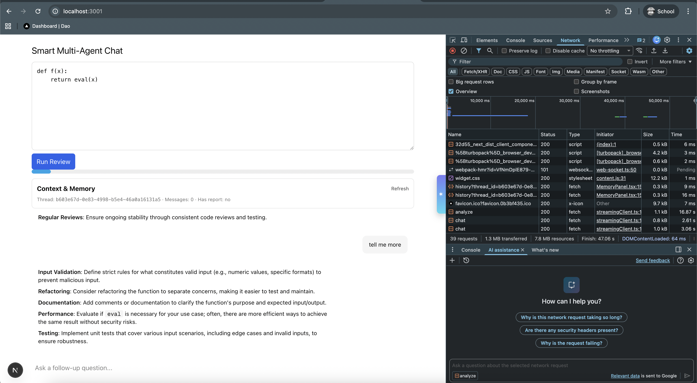
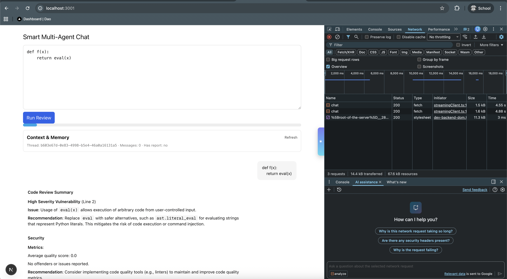
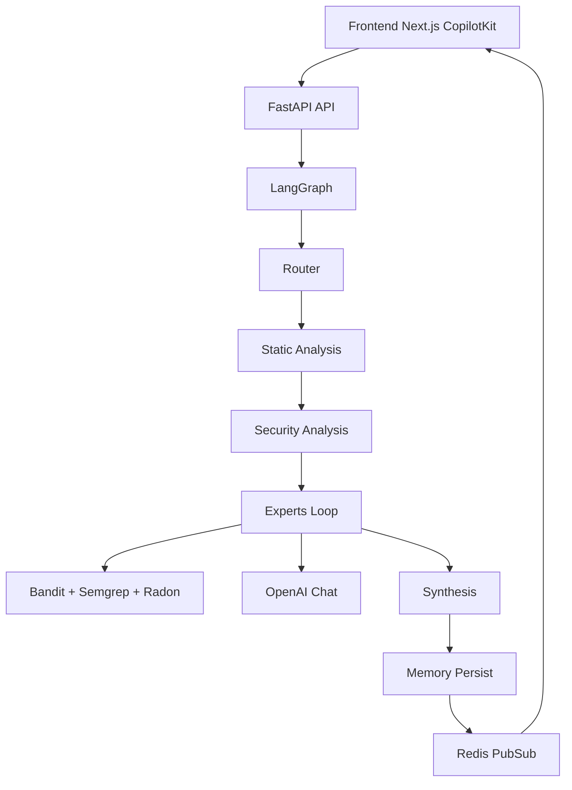

# Code Explanation Agent - Take Home Project




Build an AI agent that explains code using natural language.

## 🎯 The Challenge

Create an agent that:

1. Accepts code via a chat interface
2. Analyzes and explains the code
3. Answers follow-up questions
4. Streams responses in real-time

**What's provided:**

- ✅ FastAPI skeleton with `/explain` endpoint
- ✅ React frontend with CopilotKit chat UI
- ✅ LangGraph-ready backend structure with OpenAI models

**What you implement:**

- ⬜ Agent architecture (how do you structure the code?)
- ⬜ Code analysis logic (AST parsing? LLM prompts? Tools?)
- ⬜ Response streaming
- ⬜ Error handling

## 🚀 Quick Start

### Prerequisites

```bash
# Install UV
curl -LsSf https://astral.sh/uv/install.sh | sh

# Get an OpenAI API key
# https://platform.openai.com/
```

### Setup

```bash
# Backend
cd backend
uv sync
cp .env.example .env
# Edit .env and add your OPENAI_API_KEY

# Run
uv run python main.py

# Frontend (new terminal)
cd frontend
npm install
npm run dev
```

Visit http://localhost:3000

### Chat E2E (Backend + Frontend)

```bash
# 1) Backend (terminal A)
make install-backend
make run-backend   # serves FastAPI on http://localhost:8000

# 2) Frontend (terminal B)
cd frontend
pnpm install || npm install
# Optional: point to backend if not default
export NEXT_PUBLIC_BACKEND_URL=http://localhost:8000
pnpm dev || npm run dev  # serves Next.js on http://localhost:3000

# 3) Open http://localhost:3000 and use the Chat page
#    - Paste code and click Run (starts a chat thread)
#    - Ask follow-up questions in the input (same thread)
#    - Responses stream with progress and avoid duplicate paragraphs per thread
```

## 📋 Requirements

### Minimum (2-3 hours)

Your agent should:

- ✅ Explain what code does (basic understanding)
- ✅ Identify potential issues
- ✅ Suggest improvements
- ✅ Stream responses to the UI
- ✅ Handle errors gracefully

## ✅ Evaluation Criteria

We'll evaluate on:

1. **Code Organization** (30%)

   - How did you structure your code?
   - Is it easy to understand and maintain?
   - Good separation of concerns?

2. **Implementation Quality** (30%)

   - Does it work end-to-end?
   - Clean, readable code?
   - Proper error handling?
   - Type hints used appropriately?

3. **Architecture Decisions** (25%)

   - Smart use of LLM vs traditional parsing?
   - Good tool design (if applicable)?
   - Appropriate abstractions?

4. **Documentation** (15%)
   - Clear README explaining your approach
   - Inline comments where helpful
   - Design decisions documented

## 🔧 Development Commands

```bash
# Run server
uv run python main.py

# Run with auto-reload
uv run uvicorn main:app --reload

# Add a package
uv add package-name

# Run tests (if you add them)
uv run pytest
```

## 📝 Submission Guidelines

### Update This README

Add a new section at the bottom explaining:

1. **Architecture Overview**

   - How did you structure your code?
   - What files did you create and why?

2. **Design Decisions**

   - Why did you choose this approach?
   - What trade-offs did you make?

3. **How It Works**

   - Brief explanation of the flow
   - Key functions/classes

4. **What Would You Improve?**
   - With more time, what would you add?
   - Known limitations?

### Testing

Make sure:

- Both backend and frontend run without errors
- Can paste code and get a response
- Streaming works (not just one big chunk at the end)
- Error messages are helpful

### Code Quality

- Use type hints
- Add docstrings to classes/functions
- Handle edge cases (empty input, invalid code, etc.)
- Clean, readable code

## ❓ Questions?

If anything is unclear, make reasonable assumptions and document them in your README submission.

Good luck! 🚀

---

## 📝 Your Implementation

### Architecture Overview


- Backend (`backend/`): FastAPI `/explain`, `/analyze`, `/chat` stream incremental output as Server‑Sent Events. A compact LangGraph flow runs Quality, Bug, Security heuristics, then optional Bandit + Semgrep tooling, and finally an OpenAI synthesis that streams tokens. Progress markers are emitted as `:::progress: <0-100>` lines.
- Graph (`backend/graph/…`): Nodes per concern (router → static → security → experts loop → synthesis). Checkpointing via LangGraph (in‑memory by default, Redis optional).
- Tools (`backend/graph/tools/security_tools.py`): Bandit and Semgrep integrations with graceful fallbacks when tools are unavailable.
- Frontend (`frontend/`): React + CopilotKit UI. `CodeExplainer` performs a streaming `fetch` to `/explain`, renders activity logs, and shows a progress bar and streamed report.

#### Architecture Diagram (Mermaid)



### Design Decisions

- Plain text chunked streaming keeps the runtime simple while remaining compatible with CopilotKit UI. The client parses progress markers and shows activity logs for a responsive UX.
- Bandit/Semgrep are optional; when missing, the server reports unavailability and continues so analysis remains robust in lean environments.
- LangChain's in‑memory LLM cache reduces duplicate model calls without introducing external dependencies.

### How to Test

- Backend: `cd backend && uv sync && cp .env.example .env` then set `OPENAI_API_KEY`. Optional: `pip install semgrep`. Run `uv run uvicorn main:app --reload`.
- Frontend: `cd frontend && npm install && cp .env.example .env && npm run dev`.
- Paste code in the left panel and click Analyze. You should see activity logs, a progress bar moving to 100, and a streaming report. Without `OPENAI_API_KEY`, you still see a basic heuristic review.

### Future Improvements

- Use CopilotKit LangGraph Python SDK (`copilotkit.langgraph`) to emit intermediate state per node and stream it natively into the sidebar chat.
- Add RAG (Qdrant) + Tavily fact-checker nodes; stream their progress and integrate into synthesis.
- Framework specialist + architecture analysis nodes; language-aware AST analyzers.
